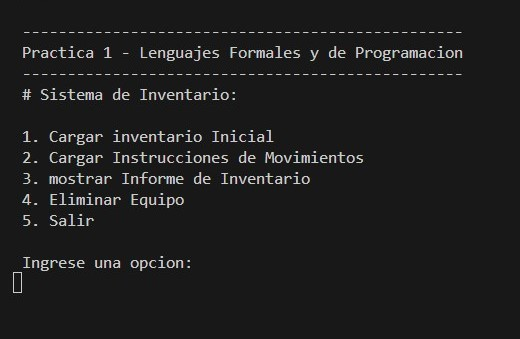
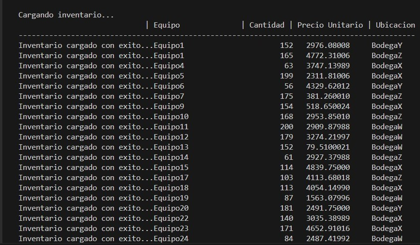
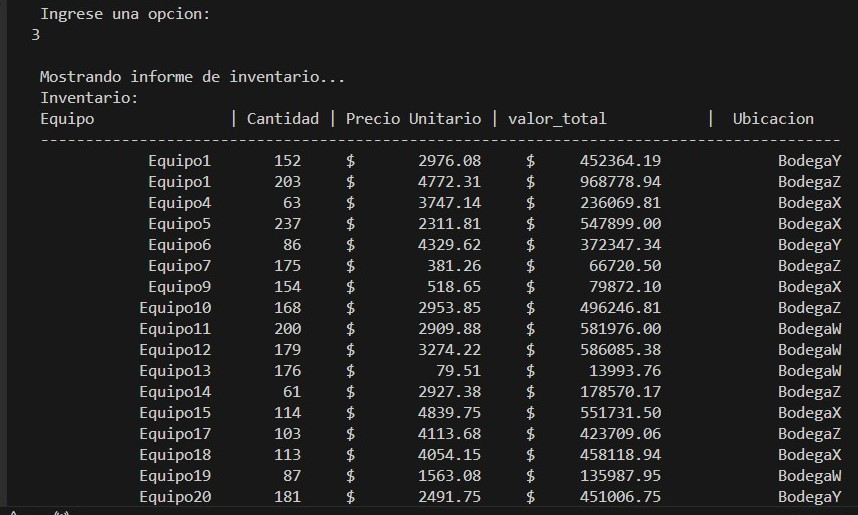
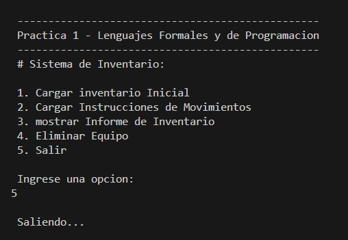

# ENUNCIADO
Se solicita al estudiante el desarrollo de un programa a consola (sin interfaz gráfica) en Fortran que permita gestionar un inventario y registrar los movimientos de equipos de oficina utilizando archivos de texto.
## MANUAL DE USUARIO
#### Recorrido del programa
En el menú de inicio están presentes las siguientes opciones:

En este apartado el usuario podrá navegar de forma que podrá ingresar las opciones que desee seleccionando un número y presionando la tecla enter.
### Cargar inventario
En este módulo el usuario podrá cargar el stock inicial de cada producto que desee tener en el inventario, el sistema reconocerá de forma automática el archivo con la extensión .inv desde la carpeta de raíz, de lo contrario dará un mensaje de error si el archivo no se encuentra en la carpeta

### Cargar instrucciones de movimiento
Este apartado servirá para agregar productos en el stock, de igual forma será desde un archivo con la extensión .mov, el usuario podrá cargar la cantidad deseada de cada productos en el sistema, si el producto cargado no se encuentra en el sistema dará un mensaje de error, de lo contrario, el número de stock aumentara de acuerdo a la cantidad de equipo cargado en la misma ubicación.

### Mostrar informe de inventario
Se podrá ingresar a este apartado seleccionando la opción 3, en este módulo el usuario podrá visualizar todo el quipo disponible en el sistema desde un archivo de texto, el programa imprime la cantidad de quipos disponibles, el precio de cada unidad, el valor total del equipo y la ubicación.

### Eliminar equipo
En este apartado el usuario podrá eliminar la cantidad deseada de cada equipo, si la cantidad a eliminar el mayor a la cantidad disponible el sistema mandara un mensaje de error, de lo contrario se eliminará la cantidad deseada.

### Salir
Si el usuario desea cerrar el programa, se podrá seleccionando la opción 5 y se cerrará el programa.
